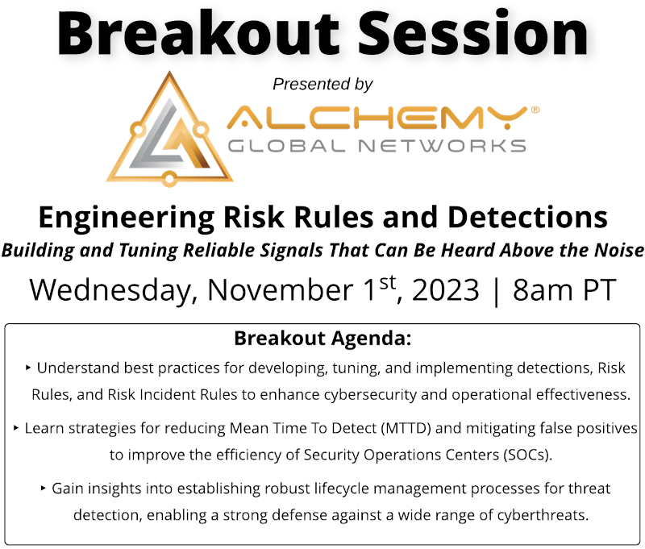
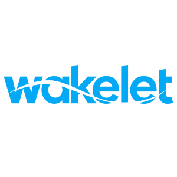

# Welcome to the RBA Community :wave_tone5: :wave_tone1: :wave_tone3: :wave_tone4: :wave_tone2:

{ align=right width=350 class="no-zoom" }
{ align=right width=350 class="no-zoom" }

## About the Community

The RBA Community is a group of professionals dedicated to advancing the field of risk-based alerting (RBA) and Splunk Enterprise Security (ES). Our mission is to provide a forum for sharing knowledge, best practices, and the latest developments in RBA and ES, and to help professionals enhance their understanding and skills in these areas.

Our vision is to be the go-to resource for anyone looking to learn more about RBA and ES. To achieve this, we offer a range of resources and services, including a podcast called The Risk Factor, a newsletter called The Risky Times, and breakout sessions hosted by our partners on topics related to RBA and ES. These resources are designed to help professionals at all levels – from beginners to experts – deepen their understanding of RBA and ES and stay up-to-date with the latest trends and developments.

Whether you’re new to RBA and ES or a seasoned pro, The RBA Community has something for everyone. We invite you to join us on this journey to enhance your understanding and expertise in RBA and ES – don’t miss out on this opportunity to learn from the best and connect with other professionals in the field.

## "The Office" Hours

Join us at “The Office” Hours, the engaging RBA Community Monthly Meetup! Connect with professionals, learn from guest speakers, and dive into risk-based alerting and Splunk Enterprise Security. Our hosts, Elizabeth, Ryan, and ZachTheSplunker, lead this interactive webinar series, where attendees can ask questions and gain insights from RBA experts. Perfect for newcomers and experienced enthusiasts alike, “The Office” Hours is your gateway to staying informed and connected in the RBA world. Don’t miss out – join the conversation!

[RSVP to "The Office" Hours :octicons-link-external-16:](https://splunk.webex.com/webappng/sites/splunk/webinar/webinarSeries/register/bf449ac6ee3042bf81ac93c118d9c8d9){ .md-button .md-button--primary target="blank" }
[Past Recordings :octicons-video-16:](library/index.md "See past sessions from The Office Hours."){ .md-button .md-button--primary }

??? abstract "Upcoming Meetups"
    **All events are hosted at 9 am PT**

    August 8

    September 12

    October 10

    November 14

    December 12

## Breakout Sessions and Virtual Workshops

### Engineering Risk Rules and Detections | Breakout Session

{ align=right width="450" }

> Building and Tuning Reliable Signals That Can Be Heard Above the Noise

This breakout session is geared toward detection engineers, program managers, project managers, threat analysts, and security engineers that are interested in modernizing their detection lifecycle management processes. While one-off detections can be effective, too many noisy rules leave SOCs desperate for a solution. 

Join us as we dive straight into best practices in developing, tuning, and implementing detections, Risk Rules and Risk Incident Rules. As we share our experiences, our goal is to put the processes, tools, and key next steps for success in your hands. That way you too can disperse the noise, reduce your MTTD, establish robust processes for your organization, and shore up a strong defense against the ever growing range of cyberthreats that seek to harm your business.

Presented by [Alchemy Global Networks](https://www.alchemy-global.net/){ target="blank" }

[Register :octicons-link-external-16:](https://splunk.webex.com/weblink/register/r55c9258dfd54bb1d7914cf6fc3899cf3 "Register"){ .md-button .md-button--primary target="blank" }

### Virtual Workshops

The Risk-Based Alerting hands-on workshop is designed to familiarize participants with the RBA methodology used in Splunk Enterprise Security. Our journey will begin with walking through the process of creating Risk Rules and Risk Data Models. From the creation of these Risk Data Models we will cover how these can lead to Risk Notables and Alerting. Users will come away with a better understanding of how to build and engineer their own Risk Rules and Risk Notables in Splunk Enterprise Security and tune these to provide more immediate insights to their analysts.

#### Who Should Attend

The workshop is designed for people on a Security Operations team that are responsible for content creation, usually the Detection Engineering team.

#### Reminder

This is a 4-hour, hands-on event. You will need your laptop, internet access and will need to join a Webex meeting to participate in this workshop.

[Schedule TBA Soon :material-clock-time-ten-outline:](){ .md-button .md-button--primary .disabled-button }
[Test Webex :material-test-tube:](https://www.webex.com/test-meeting.html "Test Webex meetings"){ .md-button target="blank" }

## Community Resources

``` markdown title="Wakelet"
    Centralized RBA Resources
```

<div class="result" markdown>

{ align=left width=200 class="no-zoom" }

Wakelet is a central hub for all your RBA resources, including blog posts, how-to guides, videos, and official documentation.

[Visit Wakelet :octicons-link-external-16:](https://wakelet.com/wake/rqjxuE9hXsCJRwWXsuHr1 "Visit Wakelet"){ .md-button .md-button--primary target="_blank" }

</div>

---

``` markdown title="Community Slack"
    RBA Community Slack channel
```

<div class="result" markdown>

{ align=left width=200 class="no-zoom" }

Our Community Slack space, hosted by Outpost Security, is the perfect place to stay up-to-date on announcements, news, and ask questions and engage in discussions with over 600 other members.

[Join The RBA Slack Channel :simple-slack:](https://outpost-security.com/slack "Join The RBA Slack Channel"){ .md-button .md-button--primary target="_blank" }

</div>

---

``` markdown title="LinkedIn Group"
    The RBA Community LinkedIn Group
```

<div class="result" markdown>

{ align=left width=200 class="no-zoom" }

Our LinkedIn Group is a great way to stay up-to-date on news and announcements, as well as network and connect with new people in the RBA community.

[Join LinkedIn Group :simple-linkedin:](https://www.linkedin.com/groups/12702283/ "Join LinkedIn Group"){ .md-button .md-button--primary target="_blank" }

</div>

---

``` markdown title="RBA GitHub"
    Specialized content
```

<div class="result" markdown>

{ align=left width=200 class="no-zoom" }

The RBA GitHub is a one-stop-shop for searches, dashboards, Q&A, and other discussions with specialized content from the RBA community. Streamline your risk analysis with simple XML or JSON dashboards and find useful SPL searches from other community members.

[Visit The RBA GitHub :simple-github:](https://splunk.github.io/rba/ "Visit The RBA GitHub"){ .md-button .md-button--primary target="_blank" }
[Visit Discussion Board :simple-github:](https://github.com/splunk/rba/discussions "Visit Discussion Board"){ .md-button .md-button--primary target="_blank" }

</div>

[rba-speakeasy]: https://www.eventbrite.com/e/a-speakeasy-hosted-by-the-rba-community-tickets-633020059037